# Building a SOC + Honeynet in Azure (Live Traffic) with Compliance

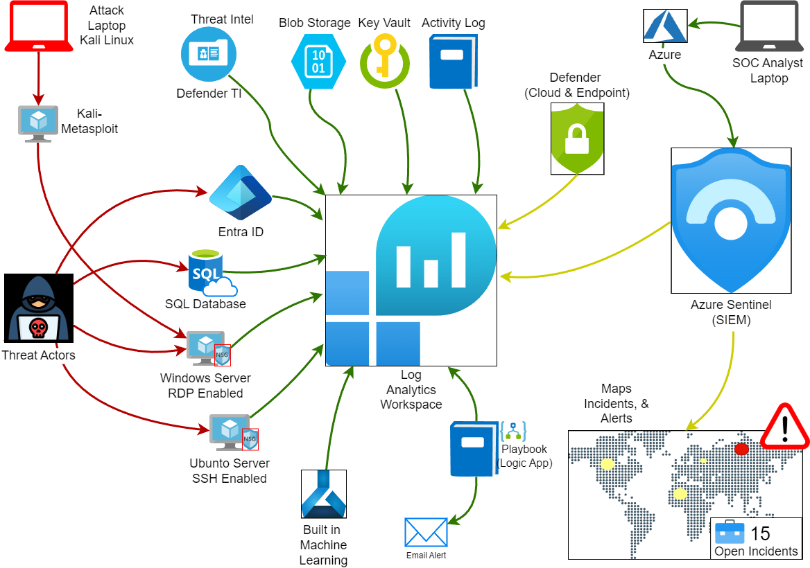

# **Introduction**

This project focuses on building a Security Operations Center (SOC) and Honeynet in Microsoft Azure, monitoring live attacks, and enforcing compliance. The goal is to detect, investigate, and mitigate real-world cyber threats using Microsoft Sentinel and Defender for Cloud.

Key objectives:

- Deploying Microsoft Sentinel as a SIEM for log collection and threat detection.
- Implementing Defender for Cloud for compliance enforcement (NIST SP 800-53).
- Utilizing Microsoft Defender Threat Intelligence (MDTI) to enrich threat investigations.
- Monitoring Windows security logs, Sysmon, and Entra ID logs for threat detection.
- Simulating a Windows brute-force attack followed by post-exploitation activities.
- Investigating the attack telemetry and correlating evidence using Sentinel logs.
- Comparing pre- and post-hardening security effectiveness.

---

## **Tools Used**

- Microsoft Sentinel – SIEM for log analysis & correlation.
- Microsoft Defender for Cloud – Compliance & security monitoring.
- Microsoft Defender Threat Intelligence (MDTI) – Threat enrichment & investigation.
- Log Analytics Workspace – Centralized security event storage.
- Windows Security Logs & Sysmon – Process execution & forensic analysis.
- Azure Entra ID Logs – Authentication monitoring & anomaly detection.
- Kali Linux (Metasploit, Reverse Shell, Mimikatz) – Attack simulation.

---

## **Environment Setup & Log Collection**

- Deployed Windows victim VMs in Azure for monitoring.
- Configured NSG rules to log and monitor external connections.
- Installed Sysmon on Windows VMs for process execution & network activity logging.
- Enabled log forwarding for:
    - Windows Security Logs (Failed logins, logon attempts, privilege escalation).
    - Entra ID Logs (Authentication tracking, MFA violations).
    - Microsoft Defender Threat Intelligence (MDTI) IP & Domain Reputation Lookups.
    - Defender for Cloud Security Alerts (Policy compliance monitoring).
- Integrated all logs into Microsoft Sentinel for correlation.

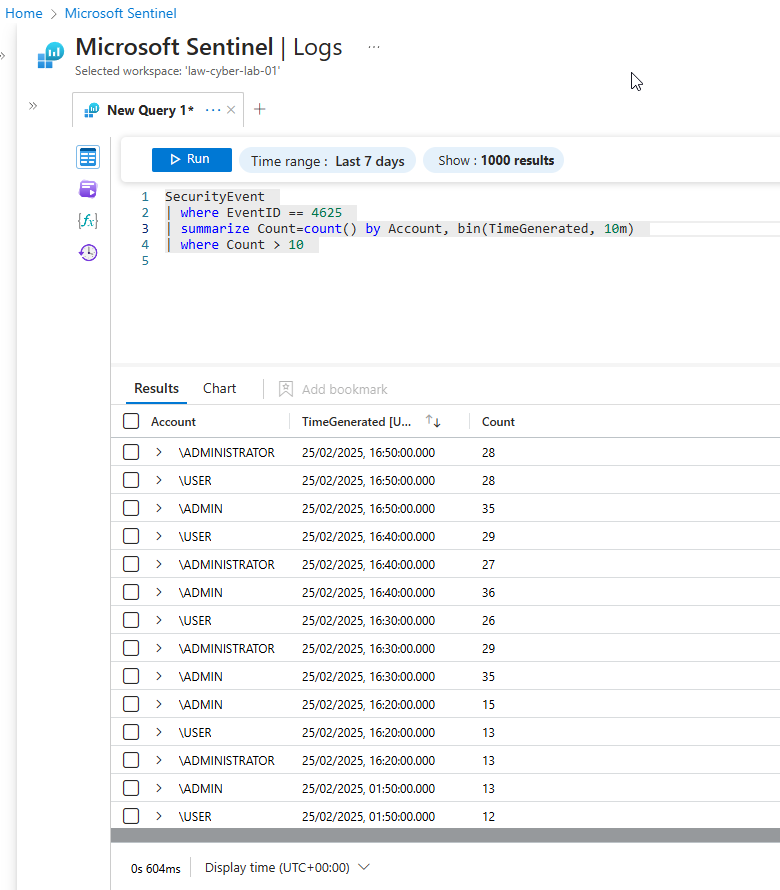

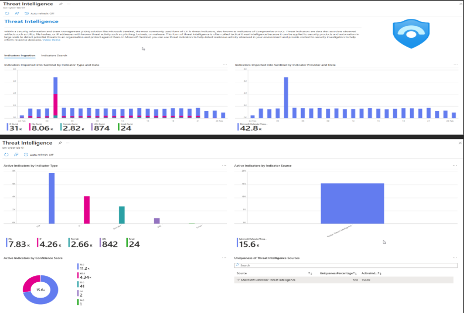

---

## **Brute Force Attack & Post-Exploitation**

- Kali Linux executed an RDP brute-force attack against a Windows VM.
- Sentinel generated an alert for multiple failed login attempts (Event ID 4625).
- Successful login achieved using brute force, triggering an alert in Defender for Cloud.
- Post-exploitation included reverse shell access, user creation for persistence, scheduled task execution, and credential dumping using Mimikatz.

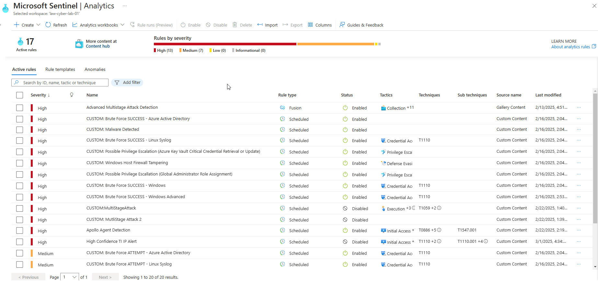

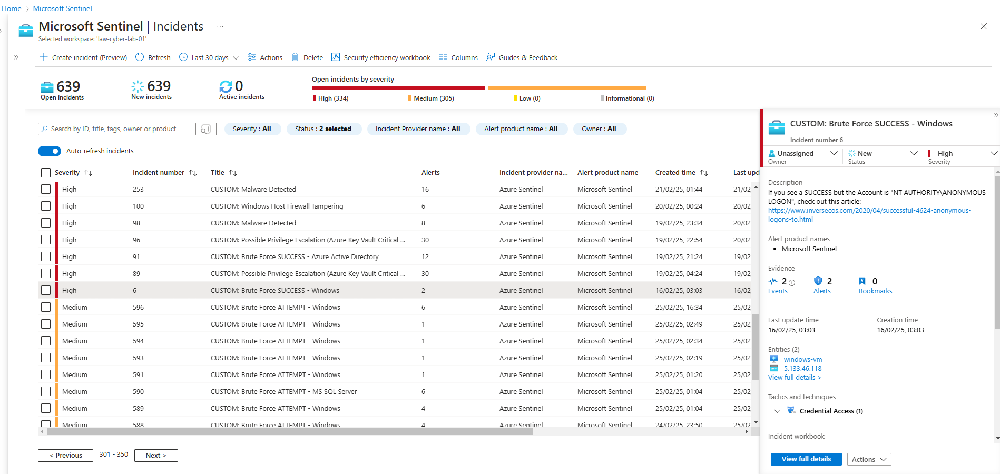

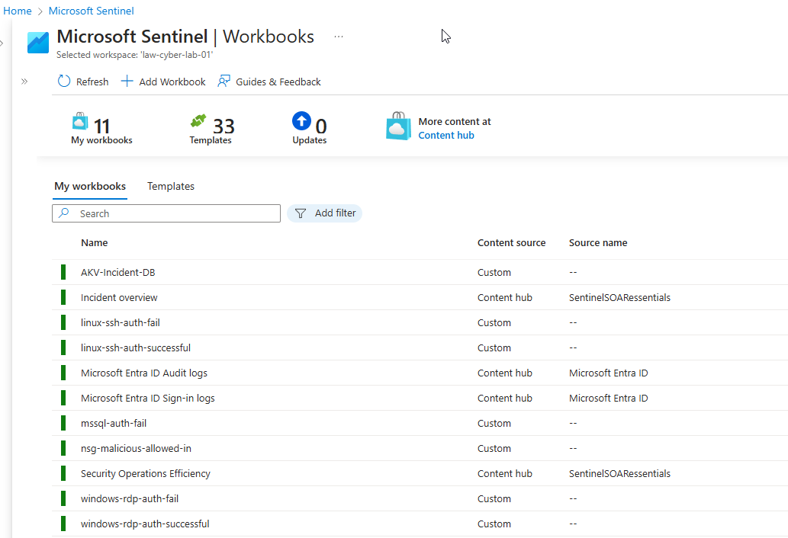

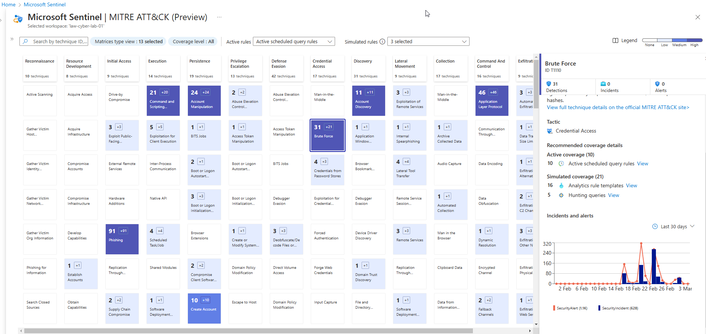

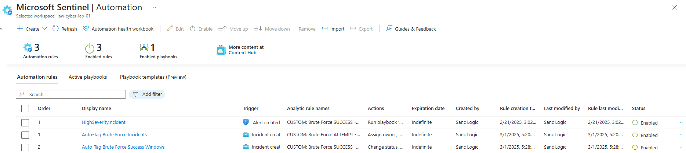

---

## **Compliance Monitoring & Security Hardening**

- Enabled Defender for Cloud for continuous compliance tracking.
- Integrated Microsoft Defender Threat Intelligence (MDTI) to correlate threat indicators.
- Implemented SC-7 (Network Security Controls) for boundary protection.
- Compliance Monitoring Implemented:
    - MFA Enforcement (Tracked failed authentication attempts in Entra ID).
    - Access Control Violations (Blocked unauthorized login attempts).
    - Encryption Compliance (Enabled full encryption for sensitive resources).
    - NSG Flow Analysis (Prevented unauthorized remote connections).

---

## **Pre-Hardening vs Post-Hardening Security Comparison**

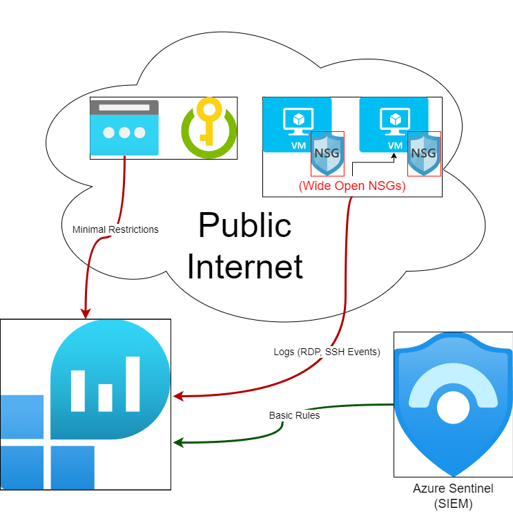

### **Before Hardening (Open System)**

- **Security Events:** 38,810
- **Syslog Events:** 15,141
- **Security Alerts:** 6
- **Security Incidents:** 416
- **Malicious Flows Allowed:** 2,263

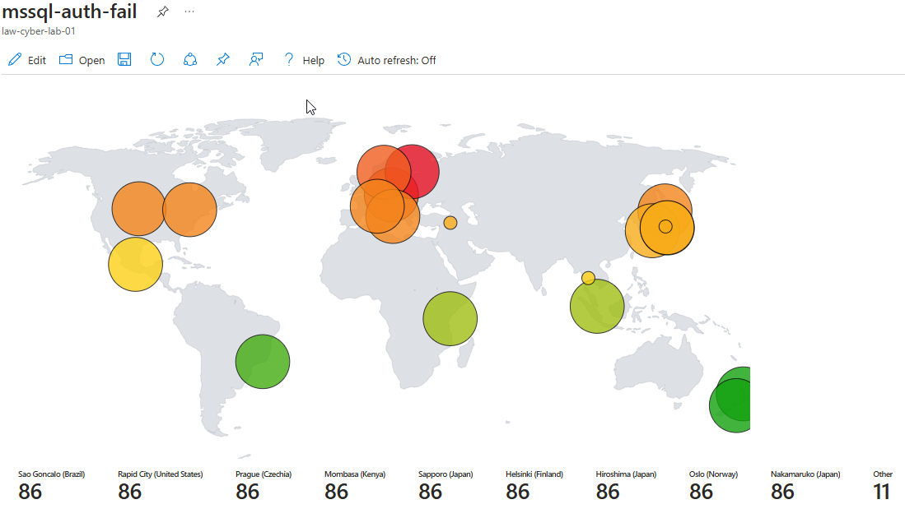

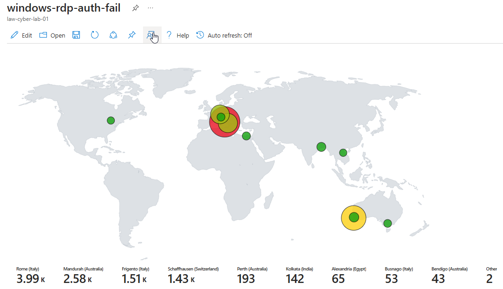

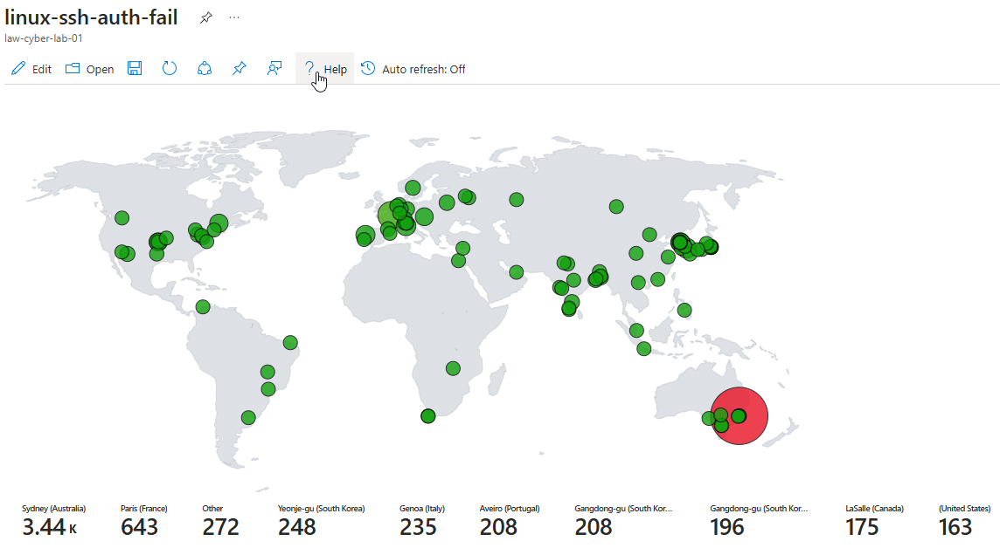

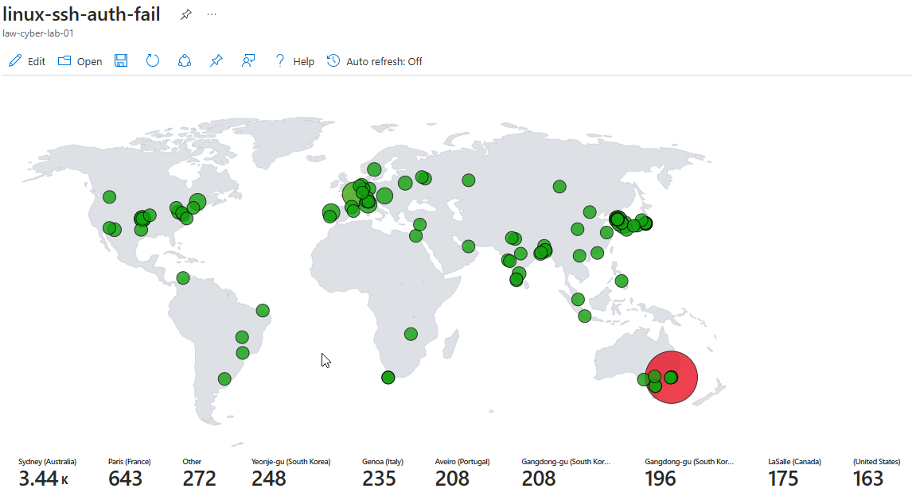

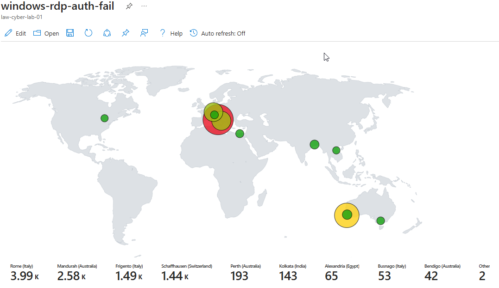

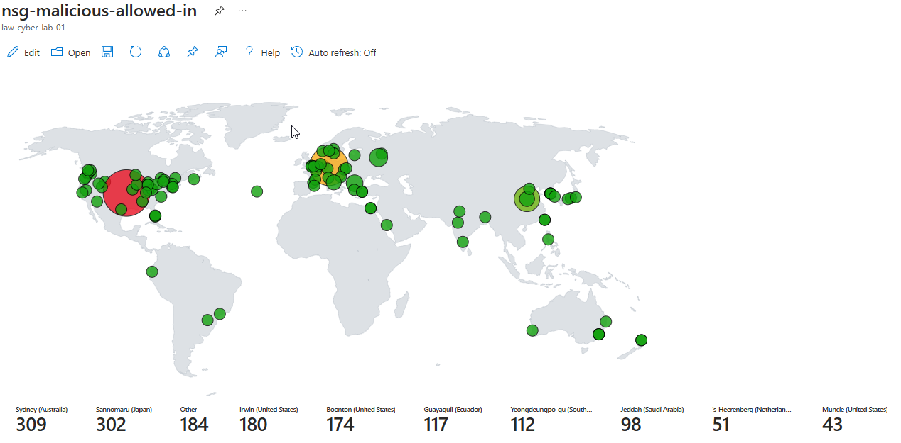

### **After Hardening (Secured System)**

- **Security Events:** 1,452
- **Syslog Events:** 14
- **Security Alerts:** 0
- **Security Incidents:** 0
- **Malicious Flows Allowed:** 0

All map queries returned no results due to no instances of malicious activity for the 24-hour period after hardening.

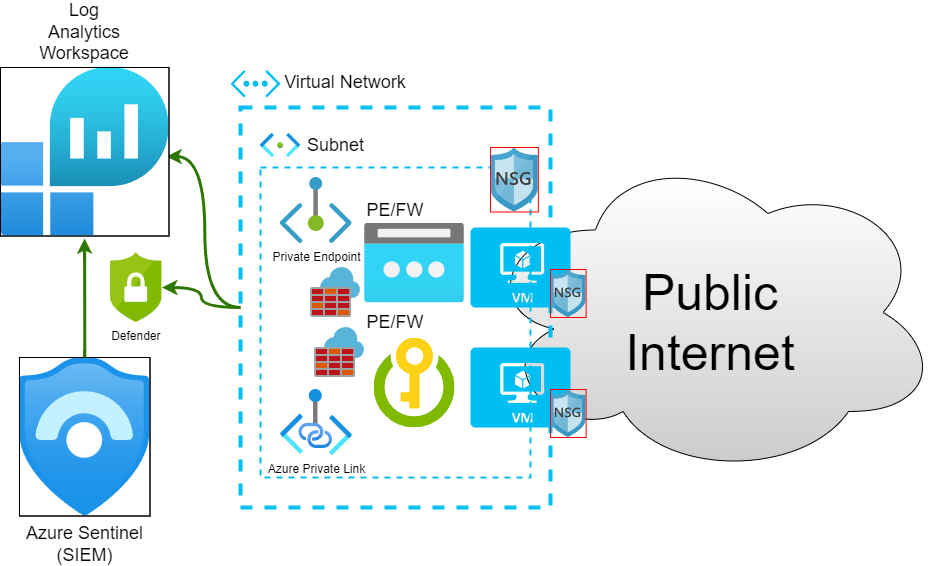

---

## Conclusion

- Successfully built an Azure-based SOC & Honeynet for real-world attack detection.
- Integrated log sources into a Log Analytics workspace and configured Microsoft Sentinel for threat detection and incident management.
- Simulated a Windows brute-force attack and investigated the incident using Sentinel logs.
- Captured credential theft (Mimikatz) and persistence attempts, analyzing post-exploitation activity.
- Utilized Microsoft Defender Threat Intelligence (MDTI) to enrich threat investigations.
- Implemented compliance monitoring with Microsoft Defender for Cloud, focusing on MFA enforcement, access control violations, and encryption compliance.
- Measured security metrics before and after hardening, confirming a significant reduction in security incidents.
- Post-hardening security controls entirely eliminated detected security incidents.
- Continuous monitoring is essential, as legitimate user activity could generate additional security events, requiring ongoing refinement of detection rules and response strategies.

---

## **Additional Resources**

- [View the Full Incident Report](docs/reports/Report%20Malicious%20Payload.md)
